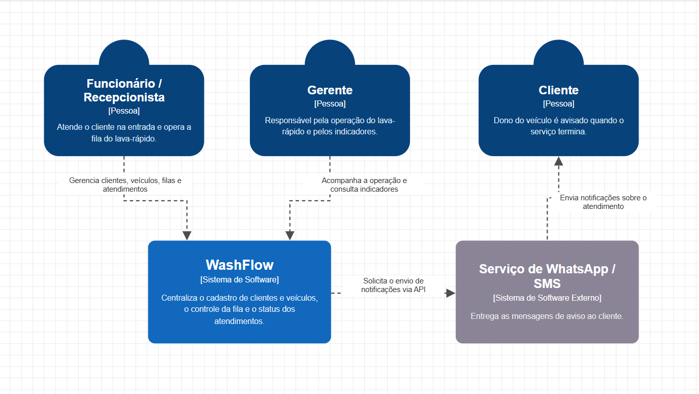
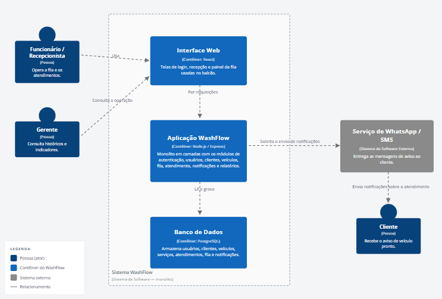
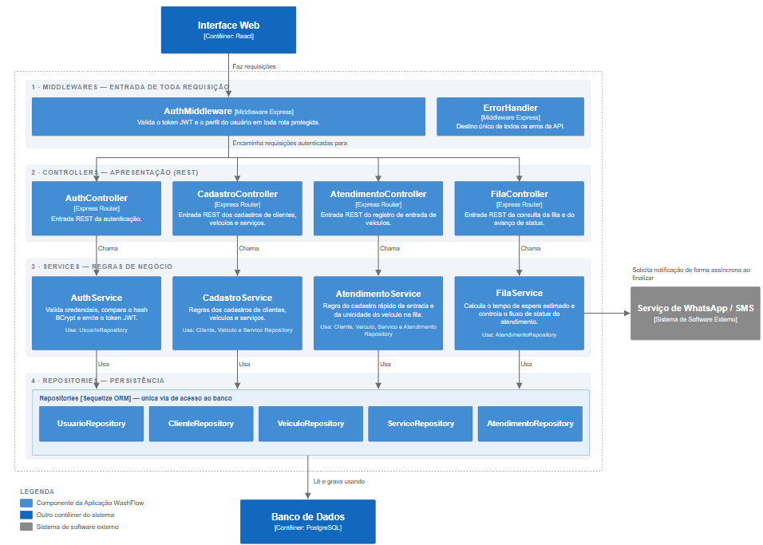
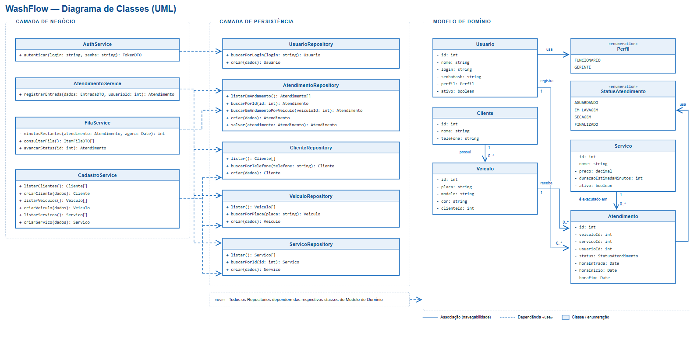

# WashFlow

**Sistema de Controle de Fila para Lava Rápido**

Projeto da disciplina de Projeto e Arquitetura de Software.

**Integrantes da equipe:** Ruan Fernandes Raulino · João Gabriel Floriano · Elias Candido · Alan Daniel

---

## 1. Contexto e Visão do Produto

### 1.1. Descrição do problema

Muitos lava rápidos operam com sistemas manuais (papel ou memória) para gerenciar a entrada e saída de veículos. Em dias de pico, isso gera desorganização na fila, perda do controle da ordem de chegada e dificuldade em estimar o tempo de espera.

Essa ineficiência operacional resulta em frustração e desistência por parte dos clientes, além de sobrecarregar os funcionários, que perdem tempo gerenciando o pátio em vez de focar na execução dos serviços.

### 1.2. O produto

O WashFlow é uma aplicação gerencial voltada para o **registro rápido da entrada de veículos**, o **controle do fluxo de lavagem em tempo real** (mudança de status) e o **cálculo estimado do tempo de espera**, com o objetivo de organizar o pátio e melhorar a comunicação de prazos com o consumidor final.

### 1.3. Público-alvo

| | Quem | Como usa o sistema |
|---|---|---|
| **Primário** | Proprietários, gerentes e funcionários da recepção/operação de lava rápidos | Operam a fila, dão entrada nos veículos e acompanham os indicadores |
| **Secundário** | Clientes (motoristas) que utilizam o estabelecimento | Não acessam o sistema: recebem as notificações e se beneficiam da previsibilidade no atendimento |

### 1.4. Escopo principal

Aplicação gerencial de uso interno do lava rápido, organizada em quatro módulos:

- **Módulo de Atendimento (Recepção)** — cadastro rápido de entrada (placa, modelo e telefone do cliente) e seleção do tipo de lavagem (Simples, Completa, Polimento).
- **Módulo de Gestão de Fila (Dashboard)** — painel visual com o status dos veículos (Aguardando, Em Lavagem, Secagem, Finalizado) e cálculo do tempo de espera estimado com base na fila atual.
- **Módulo de Notificações** — disparo de aviso (SMS ou WhatsApp) informando ao cliente que o veículo está pronto para retirada.
- **Módulo de Relatórios Básicos** — histórico de veículos atendidos no dia e tempo médio de conclusão dos serviços.

---

## 2. Requisitos do Software

### 2.1. Requisitos Funcionais

| ID | Requisito | Módulo | Nesta entrega |
|---|---|---|---|
| RF01 | Autenticar usuários do sistema com perfis distintos (Funcionário e Gerente) | Autenticação | ✅ |
| RF02 | Cadastrar e consultar clientes e seus veículos | Atendimento | ✅ |
| RF03 | Cadastrar tipos de lavagem com preço e duração estimada | Atendimento | ✅ |
| RF04 | Registrar a entrada de um veículo no pátio a partir de placa, modelo, telefone e tipo de lavagem | Atendimento | ✅ |
| RF05 | Exibir painel com a fila do pátio na ordem de chegada e o status de cada veículo | Gestão de Fila | ✅ |
| RF06 | Calcular e exibir o tempo de espera estimado com base na fila atual | Gestão de Fila | ✅ |
| RF07 | Avançar o status do atendimento seguindo o fluxo Aguardando → Em Lavagem → Secagem → Finalizado | Gestão de Fila | ✅ |
| RF08 | Notificar o cliente por SMS/WhatsApp quando o veículo estiver pronto | Notificações | ⏳ |
| RF09 | Consultar o histórico de veículos atendidos no dia | Relatórios | ⏳ |
| RF10 | Calcular o tempo médio de conclusão dos serviços | Relatórios | ⏳ |

✅ implementado nesta entrega · ⏳ previsto para as próximas etapas

### 2.2. Requisitos Não Funcionais

Os três primeiros foram priorizados pela equipe na Matriz de Atributos de Qualidade e Trade-offs; Segurança e Usabilidade completam o conjunto por serem determinantes para a viabilidade legal e operacional do produto.

| ID | Atributo de Qualidade | Métrica / Cenário de Sucesso Mensurável | Trade-off Aceito |
|---|---|---|---|
| **RNF01** | **Disponibilidade** | O sistema deve ter 99,9% de uptime durante o horário comercial do lava rápido (08h às 18h). Uma queda no sábado de manhã paralisaria o negócio. | Maior custo de infraestrutura (instâncias redundantes na nuvem) e um processo de deploy mais complexo para não gerar inatividade. |
| **RNF02** | **Desempenho e Latência** | O tempo de resposta (p95) para o cadastro de entrada de um veículo na recepção deve ser menor que 500 ms, evitando filas físicas de carros na rua. | Maior complexidade no gerenciamento de estado no front-end e possível uso de cache em memória, aceitando que o módulo de relatórios não seja atualizado em tempo real (consistência eventual). |
| **RNF03** | **Resiliência (Tolerância a Falhas)** | Se o serviço de envio de WhatsApp/SMS falhar, 100% do controle de pátio (mudança de status dos carros) deve continuar operando sem travar. | Maior complexidade arquitetural: será necessário processamento assíncrono (filas/background jobs) para as notificações, em vez de chamadas síncronas simples. |
| **RNF04** | **Segurança** | Nome, telefone e placa são dados pessoais sob a LGPD. 100% das rotas de operação exigem autenticação por token; senhas trafegam e são armazenadas apenas como hash BCrypt; operações de gestão (preço e duração dos serviços) são restritas ao perfil Gerente. | Latência adicional por hash de senha e validação de token a cada requisição, e mais código de autorização a manter em toda rota nova. |
| **RNF05** | **Usabilidade** | O registro de entrada de um veículo deve ser concluído em no máximo 4 interações e 30 segundos no balcão, com o carro parado na entrada. | Menos dados capturados no momento da entrada (apenas o essencial), exigindo complemento posterior no cadastro do cliente. |

#### Cenário de falha e resiliência

> Se a API externa do WhatsApp (responsável por avisar o cliente que o carro está pronto) ficar fora do ar por 30 minutos, o sistema aplicará o conceito de **Graceful Degradation** (Degradação Graciosa). A arquitetura será desenhada de forma assíncrona; assim, o erro na API não travará a tela do funcionário. O sistema registrará que a notificação "Falhou/Pendente", permitirá que o status do carro mude para "Finalizado" no Dashboard interno e exibirá um alerta visual para o gerente saber que precisará chamar o cliente presencialmente até que o serviço normalize.

#### Impacto da estrutura da equipe (Lei de Conway)

> Sim, existe o risco. De acordo com a Lei de Conway, se dividirmos a nossa equipe pequena em times isolados e com baixa comunicação (ex.: "time de banco de dados" e "time de front-end"), a arquitetura tenderá a ficar fragmentada e complexa. Para evitar isso e manter a simplicidade, trabalharemos com uma arquitetura de **Monolito Modular** e organizaremos a comunicação através de ritos curtos e frequentes, garantindo que todos os integrantes atuem de ponta a ponta (full-stack) no mesmo domínio de negócio, evitando integrações e camadas desnecessárias.

---

## 3. Modelo C4

Seguindo a orientação do modelo, cada nível é apresentado separadamente, do mais abrangente ao mais detalhado.

### 3.1. Nível 1 — Contexto

Visão macro do sistema: quem usa o WashFlow e com quais sistemas externos ele conversa.



O **Funcionário/Recepcionista** atende o cliente na entrada e opera a fila. O **Gerente** acompanha a operação e consulta os indicadores. O **Cliente**, dono do veículo, não opera o sistema — ele é avisado quando o serviço termina. O WashFlow centraliza o cadastro de clientes e veículos, o controle da fila e o status dos atendimentos, e depende de um único sistema externo, o **Serviço de WhatsApp/SMS**, para entregar as mensagens de aviso ao cliente.

### 3.2. Nível 2 — Container

Abrindo a caixa do WashFlow: as partes tecnológicas que compõem o sistema e como se comunicam.



| Container | Tecnologia | Responsabilidade |
|---|---|---|
| **Interface Web** | React | Telas de cadastro, painel da fila e atualização de status usadas no balcão |
| **Aplicação WashFlow** | Node.js / Express | Monolito com os módulos de autenticação, usuários, clientes, veículos, fila, atendimento, notificações e relatórios |
| **Banco de Dados** | PostgreSQL | Armazena usuários, clientes, veículos, serviços, atendimentos, fila e notificações |

A Interface Web faz requisições HTTP/JSON à Aplicação WashFlow, que lê e grava no Banco de Dados e solicita o envio de notificações ao serviço externo de WhatsApp/SMS.

### 3.3. Nível 3 — Componentes

Decomposição do container **Aplicação WashFlow** nos agrupamentos de código que o formam.



| Componente | Tecnologia | Responsabilidade |
|---|---|---|
| `AuthController` | Express Router | Ponto de entrada REST da autenticação |
| `AtendimentoController` | Express Router | Ponto de entrada REST do registro de entrada de veículos |
| `FilaController` | Express Router | Ponto de entrada REST da consulta da fila e do avanço de status |
| `CadastroController` | Express Router | Ponto de entrada REST dos cadastros de clientes, veículos e serviços |
| `AuthService` | Módulo de negócio | Valida credenciais, compara o hash BCrypt e emite o token JWT |
| `AtendimentoService` | Módulo de negócio | Regra do cadastro rápido de entrada e da unicidade do veículo na fila |
| `FilaService` | Módulo de negócio | Calcula o tempo de espera estimado e controla o fluxo de status |
| `CadastroService` | Módulo de negócio | Regras dos cadastros de apoio |
| `UsuarioRepository`, `ClienteRepository`, `VeiculoRepository`, `ServicoRepository`, `AtendimentoRepository` | Sequelize ORM | Única via de acesso ao banco de dados |
| `AuthMiddleware` | Middleware Express | Valida o token JWT e o perfil do usuário em toda rota protegida |
| `ErrorHandler` | Middleware Express | Destino único de todos os erros da API |

### 3.4. Nível 4 — Código

O nível de código do C4 é representado pelo **diagrama de classes** da seção 4, que detalha a implementação dos componentes apresentados no Nível 3.

Vale registrar a ressalva do próprio criador do modelo: diagramas em nível de código não devem ser mantidos manualmente, pois o código muda com frequência e o desenho fica desatualizado em poucas horas. Por isso, o diagrama de classes deste projeto é derivado diretamente do código-fonte versionado neste repositório e deve ser regerado a partir dele — nunca editado à mão de forma independente.

---

## 4. Diagrama de Classes (Nível 4 — Código)

Representação das classes do sistema segundo o C4, detalhando os atributos, os métodos e os relacionamentos dos componentes do Nível 3.



| Classe | Camada | Responsabilidade |
|---|---|---|
| `Usuario` | Modelo | Operador do sistema (login, hash da senha, perfil `FUNCIONARIO` ou `GERENTE`) |
| `Cliente` | Modelo | Dono do veículo (nome e telefone — dados pessoais sob LGPD) |
| `Veiculo` | Modelo | Veículo identificado pela placa, pertencente a um `Cliente` |
| `Servico` | Modelo | Tipo de lavagem, com preço e `duracaoEstimadaMinutos` |
| `Atendimento` | Modelo | Entrada de um veículo no pátio: liga `Veiculo`, `Servico` e `Usuario`, e guarda o status e os horários |
| `StatusAtendimento` | Enumeração | `AGUARDANDO`, `EM_LAVAGEM`, `SECAGEM`, `FINALIZADO` |
| `AtendimentoService` | Negócio | Registra a entrada reaproveitando cliente e veículo já cadastrados e impede duplicidade na fila |
| `FilaService` | Negócio | Monta a fila, calcula a previsão de conclusão e avança o status respeitando o fluxo |
| `AuthService` | Negócio | Autentica o usuário e emite o token JWT |
| `*Repository` | Persistência | Isolam o acesso ao banco; nenhuma outra camada executa consultas |
| `*Controller` | Apresentação | Traduzem HTTP em chamadas de serviço e serviço em resposta HTTP |

> **A fila não é uma classe persistida.** Ela é a consulta dos `Atendimento` cujo status ainda não é `FINALIZADO`, ordenados pela hora de entrada. Modelar a fila como tabela exigiria manter posições sincronizadas a cada mudança; derivá-la dos atendimentos elimina essa fonte de inconsistência.

---

## 5. Padrão de Arquitetura Adotado

O WashFlow adota **dois padrões complementares**: **Monolítico em Camadas (Layered Architecture)** como padrão principal de estruturação do sistema, e **MVC (Model-View-Controller)** como padrão de organização da apresentação.

### 5.1. Padrão principal — Monolítico em Camadas (Layered)

Todo o sistema — interface de entrada, regras de negócio e acesso ao banco — é empacotado e executado como uma **única unidade implantável** (o container `Aplicação WashFlow`), em um único processo. Dentro desse bloco único, os arquivos são organizados em **níveis horizontais de responsabilidade**, e cada camada só conversa com a camada imediatamente abaixo:

```
Rotas  →  Controllers  →  Services  →  Repositories  →  Models  →  Banco de Dados
```

**Por que esse padrão:**

1. **A equipe tem 4 pessoas atuando full-stack.** Pela Lei de Conway, a arquitetura tende a espelhar a estrutura de comunicação do time. Um time único e coeso produz naturalmente um sistema único e coeso — adotar microsserviços aqui criaria fronteiras de integração que a equipe não tem tamanho para operar, e a complexidade de rede não seria paga por nenhum ganho real.

2. **A carga do negócio não justifica distribuição.** O sistema atende **um** lava rápido, com dezenas de veículos por dia e poucos operadores simultâneos. Não existe módulo que precise escalar independentemente dos demais. Escalabilidade horizontal não figura entre os cinco requisitos não funcionais priorizados justamente por isso.

3. **É o padrão que melhor atende os RNF priorizados ao menor custo de complexidade.** A Disponibilidade (RNF01) de 99,9% em horário comercial é alcançável com instâncias redundantes de um monólito, sem orquestração de serviços. O desempenho de 500 ms no p95 (RNF02) é mais fácil de garantir sem saltos de rede entre serviços. Como afirma o material da disciplina: *"a melhor arquitetura não é a mais moderna ou a mais complexa, mas sim a que melhor resolve os requisitos de negócio com o menor custo de complexidade possível."*

4. **A separação em camadas preserva a testabilidade e a manutenibilidade.** A regra de cálculo da fila vive isolada em `FilaService`, sem qualquer dependência de HTTP ou de banco. Ela pode ser testada e alterada sem tocar em controller nem em repositório.

**Trade-off aceito:** por ser uma unidade única, todo o sistema é reimplantado a cada alteração, e um defeito grave em qualquer módulo pode derrubar a aplicação inteira. É o preço reconhecido em troca da simplicidade — e é mitigado pela disciplina de camadas, que impede que um módulo alcance diretamente as entranhas de outro.

**Ponto de atenção documentado:** o RNF03 (Resiliência) exige que a falha do serviço externo de WhatsApp/SMS não trave o controle de pátio. Dentro do monólito, isso será resolvido com **processamento assíncrono** do envio de notificações — o atendimento é finalizado e a notificação é enfileirada, nunca aguardada de forma síncrona.

### 5.2. Padrão complementar — MVC (Model-View-Controller)

O MVC organiza a camada de apresentação, distribuída entre dois containers do Nível 2:

| Papel | Onde vive | O que faz |
|---|---|---|
| **Model** | `backend/src/models/` | Entidades de domínio (`Usuario`, `Cliente`, `Veiculo`, `Servico`, `Atendimento`) e suas regras estruturais |
| **View** | Container `Interface Web` (React) | Telas de login, recepção e painel da fila. Não contém regra de negócio: consome a API através de `services/api.js` |
| **Controller** | `backend/src/controllers/` | Recebe a requisição HTTP, aciona o serviço adequado e devolve a resposta. Não contém regra de negócio |

**Por que os dois juntos:** os padrões atuam em escalas diferentes e não competem. O Layered responde *"como o sistema inteiro é dividido"*; o MVC responde *"como a entrada e a saída do usuário são organizadas dentro da camada de apresentação"*. O MVC clássico não prevê uma camada de negócio nem uma camada de persistência explícitas — é o Layered que as introduz, mantendo os controllers finos.

### 5.3. Mapa: camada → pasta do repositório

| Camada | Pasta | Regra |
|---|---|---|
| Apresentação (View) | `frontend/src/pages/` | Nunca chama a API diretamente — usa `frontend/src/services/` |
| Rotas | `backend/src/routes/` | Mapeia URL para controller e declara a validação de entrada |
| Apresentação (Controller) | `backend/src/controllers/` | Nenhuma regra de negócio |
| Negócio | `backend/src/services/` | Todas as regras. Não conhece HTTP |
| Persistência | `backend/src/repositories/` | Única camada que consulta o banco |
| Domínio (Model) | `backend/src/models/` | Entidades e associações |
| Transferência | `backend/src/dtos/` | Impede que dados sensíveis (ex.: hash de senha) saiam da API |

---

## 6. Ferramentas e Tecnologias Escolhidas

As escolhas abaixo foram feitas para atender os requisitos não funcionais priorizados ao menor custo de complexidade — coerentes com a decisão por um monólito em camadas operado por uma equipe pequena e full-stack.

### 6.1. Back-end

| Ferramenta | Papel no projeto | Por que foi escolhida |
|---|---|---|
| **Node.js** | Ambiente de execução da aplicação | Modelo de I/O não bloqueante, adequado a uma API cujas operações são majoritariamente consultas ao banco. Permite que toda a equipe trabalhe em uma única linguagem (JavaScript) no back e no front, reduzindo o custo de troca de contexto — decisivo para um time de 4 pessoas atuando full-stack |
| **Express** | Framework HTTP | Minimalista e sem estrutura imposta, o que nos deixa organizar as pastas nas camadas que a arquitetura exige, em vez de aceitar a divisão do framework. A cadeia de middlewares atende diretamente os requisitos de autenticação e tratamento centralizado de erros |
| **Sequelize** | ORM (mapeamento objeto-relacional) | Isola a camada de persistência do banco concreto: a mesma base de código roda em PostgreSQL e em SQLite trocando uma variável de ambiente. Representa cada tabela como uma classe, o que mantém os modelos alinhados ao diagrama de classes |
| **PostgreSQL** | Banco de dados | Relacional e transacional, adequado a um domínio com integridade referencial forte (cliente → veículo → atendimento). Suporta as garantias de consistência que a fila exige |
| **SQLite** | Banco de desenvolvimento | Permite executar o projeto sem instalar servidor de banco, encurtando a configuração de ambiente de cada integrante. Não é o destino de produção |
| **bcryptjs** | Hash de senhas | Algoritmo de hash com salt e custo configurável, próprio para senhas. Atende o RNF04: a senha nunca é armazenada nem trafega em texto puro |
| **jsonwebtoken** | Autenticação por token | Token assinado e stateless, sem sessão no servidor. Além de atender o RNF04, mantém a aplicação preparada para escalar horizontalmente sem compartilhar estado entre instâncias — o que sustenta a Disponibilidade do RNF01 |
| **express-validator** | Validação de entrada | Validação declarativa na borda da API. Garante que dados inválidos (placa fora do padrão, telefone incompleto) sejam rejeitados antes de alcançar a camada de negócio |
| **cors** | Controle de origem | Restringe quais origens podem consumir a API, já que o front-end roda em outro endereço |
| **dotenv** | Configuração por ambiente | Mantém segredos (chave do JWT, credenciais do banco) fora do código versionado |

### 6.2. Front-end

| Ferramenta | Papel no projeto | Por que foi escolhida |
|---|---|---|
| **React** | Biblioteca de interface | Interface baseada em estado, adequada a um painel que muda o tempo todo conforme os veículos avançam na fila. Componentização permite reaproveitar a estrutura das telas |
| **Vite** | Build e servidor de desenvolvimento | Inicialização quase instantânea e recarregamento imediato, encurtando o ciclo de desenvolvimento |
| **React Router** | Navegação | Navegação entre a tela de recepção e o painel da fila sem recarregar a página, mantendo a resposta percebida dentro do que o RNF05 exige |
| **Fetch API** | Comunicação com o back-end | Nativa do navegador, sem dependência adicional. Encapsulada em `services/api.js`, que centraliza a URL da API e a injeção do token |

### 6.3. Apoio

| Ferramenta | Papel no projeto |
|---|---|
| **Git e GitHub** | Versionamento e repositório central da equipe |
| **Draw.io** | Elaboração dos diagramas C4 e do diagrama de classes |

---

## 7. Projeto Desenvolvido até o Momento

Esta entrega corresponde a aproximadamente **35% do projeto**. O recorte priorizou o **núcleo operacional** do produto — o fluxo que o recepcionista executa dezenas de vezes por dia — porque é ele que valida a arquitetura escolhida de ponta a ponta, atravessando todas as camadas.

### 7.1. Funcionalidades em operação

**Autenticação e controle de acesso**
- Login com emissão de token JWT
- Dois perfis com permissões distintas: Funcionário e Gerente
- Senhas armazenadas apenas como hash BCrypt
- Todas as rotas de operação protegidas por token

**Módulo de Atendimento (Recepção)**
- Registro de entrada de veículo em uma única requisição, a partir de placa, modelo, cor, nome e telefone do cliente e tipo de lavagem
- Reaproveitamento automático de cliente e veículo já cadastrados
- Normalização e validação de placa (formatos antigo `ABC1234` e Mercosul `ABC1D23`)
- Cadastro e consulta de clientes, veículos e tipos de lavagem

**Módulo de Gestão de Fila**
- Painel com a fila do pátio em ordem de chegada
- Cálculo da previsão de conclusão de cada veículo, acumulada posição a posição e descontando o tempo já decorrido do veículo em serviço
- Avanço de status pelo fluxo Aguardando → Em Lavagem → Secagem → Finalizado, com registro dos horários de início e fim
- Atualização automática do painel a cada 15 segundos

**Interface Web**
- Tela de Login
- Tela de Recepção com o formulário de entrada rápida
- Painel da Fila com os botões de avanço de status

### 7.2. Regras de negócio implementadas

- Um veículo não pode ocupar duas posições na fila simultaneamente
- O status não pode pular etapas nem retroceder
- Um atendimento finalizado não pode ser avançado novamente
- Um veículo finalizado sai da fila e a previsão dos demais é recalculada
- Apenas o perfil Gerente pode cadastrar tipos de lavagem (definir preço e duração)
- O hash da senha nunca é devolvido por nenhuma rota

### 7.3. Comportamentos verificados

| Cenário | Resposta |
|---|---|
| Acesso a rota protegida sem token | `401` |
| Login com senha incorreta | `401`, com mensagem genérica que não revela se o login existe |
| Placa fora do padrão | `400` |
| Veículo já presente na fila | `409` |
| Avanço de atendimento já finalizado | `409` |
| Atendimento inexistente | `404` |
| Funcionário tentando cadastrar tipo de lavagem | `403` |
| Fila com lavagens de 30, 60 e 120 min | Previsões de 30, 90 e 210 min |
| Após finalizar o primeiro veículo | Previsões recalculadas para 60 e 180 min |

### 7.4. O que a entrega demonstra sobre a arquitetura

O fluxo implementado atravessa **todas as camadas** do padrão declarado na seção 5: uma requisição de entrada de veículo passa por rota → validação → middleware de autenticação → controller → service → repository → model → banco, e volta como DTO. A regra mais complexa do sistema — o cálculo da fila — está isolada em `FilaService`, sem qualquer dependência de HTTP ou de Sequelize, comprovando na prática a separação que a arquitetura promete.

---

## 8. Próximas Etapas do Desenvolvimento

### Etapa 2 — Módulo de Notificações (RF08)

Implementar o disparo de aviso ao cliente quando o veículo for finalizado, integrando a Aplicação WashFlow ao serviço externo de WhatsApp/SMS documentado no C4 Nível 1.

O ponto de integração já está previsto e marcado em `FilaService.avancarStatus`. O envio será **assíncrono**, para atender o RNF03: o atendimento é finalizado e a notificação é enfileirada, nunca aguardada. Uma falha do serviço externo registrará a notificação como "Pendente" e exibirá alerta ao gerente, sem impedir a operação do pátio — é a aplicação concreta da Degradação Graciosa descrita na seção 2.2.

Entregáveis: entidade `Notificacao` com status de envio, `NotificacaoService` com fila de reprocessamento, política de novas tentativas e indicador visual de pendência no painel.

### Etapa 3 — Módulo de Relatórios (RF09 e RF10)

Histórico de veículos atendidos no dia e cálculo do tempo médio de conclusão por tipo de serviço, destinados ao perfil Gerente.

Entregáveis: `RelatorioService`, consultas por período no `AtendimentoRepository`, tela de relatórios restrita ao Gerente e comparação entre duração estimada e duração real, que permitirá calibrar as estimativas exibidas na fila.

### Etapa 4 — Qualidade e aderência aos requisitos não funcionais

- **Testes automatizados** das regras de negócio, com foco em `FilaService` e `AtendimentoService`
- **Medição de desempenho** do endpoint de entrada de veículo, para confirmar o p95 abaixo de 500 ms exigido pelo RNF02
- **Refinamento de usabilidade** do formulário de recepção, validando em cronômetro o limite de 30 segundos do RNF05
- **Preparação para implantação** com PostgreSQL, variáveis de ambiente de produção e verificação de saúde da aplicação, sustentando a meta de 99,9% de disponibilidade do RNF01

---

## 9. Estrutura do Repositório e Execução

```
WashFlow/
├── README.md                  Documentação do projeto
├── docs/                      Diagramas C4 e diagrama de classes
├── backend/                   API - Node.js / Express
│   └── src/
│       ├── config/            Conexão com o banco, constantes e carga inicial
│       ├── routes/            Camada de rotas
│       ├── controllers/       Camada de apresentação
│       ├── services/          Camada de negócio
│       ├── repositories/      Camada de persistência
│       ├── models/            Entidades de domínio
│       ├── dtos/              Objetos de transferência
│       └── middlewares/       Autenticação, validação e tratamento de erros
└── frontend/                  Interface Web - React
    └── src/
        ├── pages/             Telas (View)
        └── services/          Comunicação com a API
```

**Back-end** (porta 3000):

```bash
cd backend
cp .env.example .env
npm install
npm run dev
```

**Front-end** (porta 5173):

```bash
cd frontend
cp .env.example .env
npm install
npm run dev
```

O banco de destino documentado é o **PostgreSQL**. Para desenvolvimento local, `DB_DIALECT=sqlite` no `.env` permite rodar o projeto sem instalar o Postgres; a aplicação não percebe a diferença. Na primeira execução o sistema cria as tabelas e a carga inicial.

**Usuários de demonstração:** `recepcao` / `recepcao123` (Funcionário) e `gerente` / `gerente123` (Gerente).
